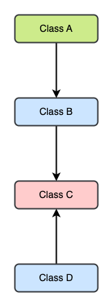

# OOP Laboratory
## Lab 04: Inheritance and Polymorphism

## Student Information
- Name: Phạm Gia Phúc
- ID: ITCSIU22178

## Task 1: Understand and use inheritance
1. Which class is the superclass? Which is the subclass? What does it mean that the Cat class extends the Animal class?
   - The `Animal` class is the superclass. The `Cat` class is the subclass. The `Cat` class extends `Animal` class means that
`Cat` class can use the methods and attributes/fields inside its class and its superclass depending on the access modifiers.
2. The Cat class cannot directly access the fields it inherits from Animal. Why not?
- Because the fields have the `private` access modifier which mean that the superclass of `Cat` class can use but not the `Cat` class.
3. The subclass constructor typically calls the superclass constructor to initialize the inherited fields
- [Code](./inheritance/Cat.java)
4. To manipulate the inherited fields, the subclass can use the inherited accessor (getter) and mutator
   (setter) methods. Write a toString method for the Cat class above. It should return a string
   consisting of the cat’s name followed by either " (short-haired)" or " (long-haired)".
- [Code](./inheritance/Cat.java)
5. The subclass can override an inherited method, replacing it with a version that is more appropriate. 
Write an isSleeping method for the Cat class. It should reflect the fact that cats seem to sleep all the time!
- [Code](./inheritance/Cat.java)
6. Let’s say that we now want to define a class called Abyssinian for cats that belong to that particular breed of short-haired cat. Which class should it extend?
- It should extend the `Cat` class
7. Go ahead and create a class named Abyssinian, defining it so that it extends the correct class. It should not have any new fields of its own.
- [Code](./inheritance/Abyssinian.java)
8. Another possible class for this hierarchy of animals is the Dog class, which you should examine now, although you don’t need to open it. In addition to its inherited fields and methods, it has a boolean field isSmall, and methods isSmall() and bark().
- [Code](./inheritance/Dog.java)
9. Let’s say that we have created an Abyssinian object and assigned it to the variable a
10. Abyssinian a = new Abyssinian("Abby");
- [Code](./inheritance/Main.java)

## Task 2: Understand polymorphism
1. Draw an inheritance hierarchy for these classes.

2. Which of these assignments would be allowed, taking into account the rules of polymorphism?

a. B myObj = new A(): allow

b. B myObj = new C(): not allow

c. C myObj = new A(): not allow

d. A myObj = new B(): not allow

e. D myObj = new B(): not allow

## Task 3: The ArrayBag class
1. What are the fields of the ArrayBag class, and why did we include them in our definition?
- The fields of the ArrayBag class are `Object[] items`, `int numItems` and `int DEFAULT_MAX_SIZE` to declare and initialize the object's attribute.

2 + 3 + 4. Implement the code

[code](./polymorphism/ArrayBag.java)
5. Let’s say that we now want to “grab” one of the items that we just added to b. What happens when you do the following?
- The code you provided appears to use a custom class called ArrayBag to add elements to a bag-like data structure and then attempt to grab an item from it.

